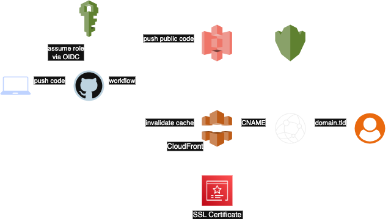

# Terraform AWS SPA Module

## Diagram



## Overview

This module creates a private S3 bucket, an ACM certificate for your custom domain (if provided, otherwise it would use the CloudFront default certificate), a CloudFront distribution, a KMS key to encrypt the S3 bucket (optional), and an IAM role with the necessary permissions for GitHub to perform three actions:

1. Authenticate with AWS using OIDC and assume the IAM role
2. Sync the specified local folder with the S3 bucket
3. Invalidate the cache in CloudFront

The module is designed primarily to provide the infrastructure for hosting a static website, ensuring modern standards and enhanced security, all while minimizing costs to a minimum.

## Usage

### Terraform

#### Using your own public domain (recommended)

```hcl
module "this" {
  source  = "dsarrias/terraform-aws-spa"

  providers = {
    aws.useast1 = aws.useast1
  }

  bucket_name    = var.bucket_name
  domain         = var.domain
  web_repository = var.web_repository
}

provider "aws" {
  alias  = "useast1"
  region = "us-east-1"
}

```

If you provided your own domain using the variable `domain`, then first apply only the ACM certificate using the `-target` flag, like:
```hcl
terraform apply -target="module.this.aws_acm_certificate.this[0]"
```

 After that, add the validation record in your DNS registar, and, once validated, apply the rest of the module. 
 
 The reason behind this is that CloudFront will expect the ACM certificate to be ready. However, since this resource won't be available until the validation process is complete, the apply will fail because the CloudFront distribution cannot be created.

#### Using only CloudFront's endpoint and encrypting the bucket with a KMS key
You can pass any provider, it won't be used. It's just required because the ACM resource needs this.

```hcl
module "this" {
  source  = "dsarrias/terraform-aws-spa"

  providers = {
    aws.useast1 = aws
  }

  bucket_name    = var.bucket_name
  web_repository = var.web_repository
  create_kms_key = true
}
```

### GitHub

This part will create a workflow that will be triggered every time a change in the directory of the website's files occurs in the main branch.

You are free to integrate the workflow insise the same repository as the Terraform code or isolate the website code in a different one.

1. Go to the repository you will store the static website
2. Go to Settings > Secrets and variables > Actions > Variables > Repository variables and add the next variables with the values you need:
    - `AWS_ACCOUNT_ID`
    - `BUCKET_NAME`
    - `AWS_REGION`
    - `CLOUDFRONT_DIST_ID`
3. Add the next block in your repository under `.github/workflows/deploy.yml` or go to Actions > New workflow and save it there. Make sure you change the values mentioned with the comment `# Change this`.

```yml
name: Deploy to S3 and Invalidate CloudFront

on:
  push:
    branches: [main]
    paths:
      - 'modules/aws/web/public/**'   # Change this

env:
  SYNC_SOURCE: modules/aws/web/public # Change this
  AWS_ACCOUNT_ID: ${{ vars.AWS_ACCOUNT_ID }}
  BUCKET_NAME: ${{ vars.BUCKET_NAME }}
  AWS_REGION: ${{ vars.AWS_REGION }}
  CLOUDFRONT_DIST_ID: ${{ vars.CLOUDFRONT_DIST_ID }}

permissions:
  id-token: write
  contents: read

jobs:
  deploy:
    runs-on: ubuntu-latest

    steps:
      - name: Checkout repo
        uses: actions/checkout@v4

      - name: Configure AWS credentials via OIDC
        uses: aws-actions/configure-aws-credentials@v4
        with:
          role-to-assume: arn:aws:iam::${{ env.AWS_ACCOUNT_ID }}:role/GitHubS3Deployer
          aws-region: ${{ env.AWS_REGION }}

      - name: Sync to S3 bucket
        run: aws s3 sync ${{ env.SYNC_SOURCE }} s3://${{ env.BUCKET_NAME }} --delete

      - name: Invalidate CloudFront cache
        run: |
          aws cloudfront create-invalidation \
            --distribution-id ${{ env.CLOUDFRONT_DIST_ID }} \
            --paths "/*"
```

<!-- BEGIN_TF_DOCS -->

## Requirements

| Name | Version |
|------|---------|
| <a name="requirement_terraform"></a> [terraform](#requirement\_terraform) | >= 0.13.0 |
| <a name="requirement_aws"></a> [aws](#requirement\_aws) | >= 4.29 |
| <a name="requirement_random"></a> [random](#requirement\_random) | >= 2.1.0 |

## Providers

| Name | Version |
|------|---------|
| <a name="provider_aws"></a> [aws](#provider\_aws) | >= 4.29 |
| <a name="provider_aws.useast1"></a> [aws.useast1](#provider\_aws.useast1) | >= 4.29 |
| <a name="provider_random"></a> [random](#provider\_random) | >= 2.1.0 |

## Resources

| Name | Type |
|------|------|
| [aws_acm_certificate.this](https://registry.terraform.io/providers/hashicorp/aws/latest/docs/resources/acm_certificate) | resource |
| [aws_cloudfront_distribution.this](https://registry.terraform.io/providers/hashicorp/aws/latest/docs/resources/cloudfront_distribution) | resource |
| [aws_cloudfront_origin_access_control.this](https://registry.terraform.io/providers/hashicorp/aws/latest/docs/resources/cloudfront_origin_access_control) | resource |
| [aws_iam_openid_connect_provider.github](https://registry.terraform.io/providers/hashicorp/aws/latest/docs/resources/iam_openid_connect_provider) | resource |
| [aws_iam_role.github](https://registry.terraform.io/providers/hashicorp/aws/latest/docs/resources/iam_role) | resource |
| [aws_iam_role_policy.github](https://registry.terraform.io/providers/hashicorp/aws/latest/docs/resources/iam_role_policy) | resource |
| [aws_kms_alias.this](https://registry.terraform.io/providers/hashicorp/aws/latest/docs/resources/kms_alias) | resource |
| [aws_kms_key.this](https://registry.terraform.io/providers/hashicorp/aws/latest/docs/resources/kms_key) | resource |
| [aws_s3_bucket.this](https://registry.terraform.io/providers/hashicorp/aws/latest/docs/resources/s3_bucket) | resource |
| [aws_s3_bucket_policy.this](https://registry.terraform.io/providers/hashicorp/aws/latest/docs/resources/s3_bucket_policy) | resource |
| [aws_s3_bucket_public_access_block.this](https://registry.terraform.io/providers/hashicorp/aws/latest/docs/resources/s3_bucket_public_access_block) | resource |
| [aws_s3_bucket_server_side_encryption_configuration.this](https://registry.terraform.io/providers/hashicorp/aws/latest/docs/resources/s3_bucket_server_side_encryption_configuration) | resource |
| [aws_s3_bucket_website_configuration.this](https://registry.terraform.io/providers/hashicorp/aws/latest/docs/resources/s3_bucket_website_configuration) | resource |
| [random_id.this](https://registry.terraform.io/providers/hashicorp/random/latest/docs/resources/id) | resource |
| [aws_caller_identity.current](https://registry.terraform.io/providers/hashicorp/aws/latest/docs/data-sources/caller_identity) | data source |
| [aws_cloudfront_cache_policy.this](https://registry.terraform.io/providers/hashicorp/aws/latest/docs/data-sources/cloudfront_cache_policy) | data source |
| [aws_iam_policy_document.github](https://registry.terraform.io/providers/hashicorp/aws/latest/docs/data-sources/iam_policy_document) | data source |
| [aws_iam_policy_document.github_assume](https://registry.terraform.io/providers/hashicorp/aws/latest/docs/data-sources/iam_policy_document) | data source |
| [aws_iam_policy_document.kms](https://registry.terraform.io/providers/hashicorp/aws/latest/docs/data-sources/iam_policy_document) | data source |
| [aws_iam_policy_document.s3](https://registry.terraform.io/providers/hashicorp/aws/latest/docs/data-sources/iam_policy_document) | data source |

## Inputs

| Name | Description | Type | Default | Required |
|------|-------------|------|---------|:--------:|
| <a name="input_allowed_methods"></a> [allowed\_methods](#input\_allowed\_methods) | List of allowed HTTP methods that CloudFront processes and forwards to the origin. | `list(string)` | <pre>[<br/>  "GET",<br/>  "HEAD"<br/>]</pre> | no |
| <a name="input_bucket_name"></a> [bucket\_name](#input\_bucket\_name) | Unique name for the bucket to be created. If not used the bucket will have the project name as a prefix. | `string` | `null` | no |
| <a name="input_cache_policy"></a> [cache\_policy](#input\_cache\_policy) | The cache policy ID or name used by CloudFront for the distribution's behavior. | `string` | `"Managed-CachingOptimized"` | no |
| <a name="input_cached_methods"></a> [cached\_methods](#input\_cached\_methods) | List of HTTP methods that CloudFront caches responses for. | `list(string)` | <pre>[<br/>  "GET",<br/>  "HEAD"<br/>]</pre> | no |
| <a name="input_cloudfront_default_certificate"></a> [cloudfront\_default\_certificate](#input\_cloudfront\_default\_certificate) | `true` only allows TLSv1 and makes variable `domain` unused. `false` forces using a custom domain that creates a cert using `minimum_protocol_version`. | `bool` | `false` | no |
| <a name="input_create_kms_key"></a> [create\_kms\_key](#input\_create\_kms\_key) | If enabled it will create a KMS key to be used in the S3 buckets instead of the default 'aws/s3' AWS KMS master key. | `bool` | `false` | no |
| <a name="input_custom_error_response"></a> [custom\_error\_response](#input\_custom\_error\_response) | Custom error response settings for CloudFront, allowing you to serve custom error pages. | <pre>object({<br/>    error_caching_min_ttl = number<br/>    error_code            = number<br/>    response_code         = number<br/>    response_page_path    = string<br/>  })</pre> | <pre>{<br/>  "error_caching_min_ttl": 10,<br/>  "error_code": 404,<br/>  "response_code": 200,<br/>  "response_page_path": "/404.html"<br/>}</pre> | no |
| <a name="input_default_root_object"></a> [default\_root\_object](#input\_default\_root\_object) | The object that CloudFront returns when the root URL of the distribution is requested. | `string` | `"index.html"` | no |
| <a name="input_domain"></a> [domain](#input\_domain) | yourdomain.tld - This will be used to create the certificate CloudFront will use. | `string` | `""` | no |
| <a name="input_http_version"></a> [http\_version](#input\_http\_version) | The HTTP version that CloudFront will support when communicating with viewers. | `string` | `"http2"` | no |
| <a name="input_kms_key_id"></a> [kms\_key\_id](#input\_kms\_key\_id) | Your own KMS key ID to encrypt S3 objects. | `string` | `null` | no |
| <a name="input_minimum_protocol_version"></a> [minimum\_protocol\_version](#input\_minimum\_protocol\_version) | The minimum SSL/TLS protocol version that CloudFront will support for HTTPS connections. | `string` | `"TLSv1.2_2021"` | no |
| <a name="input_namespace"></a> [namespace](#input\_namespace) | Namespace used to generate the S3 bucket name and KMS alias in case of usage. Not needed if using `bucket_name`. | `string` | `"website-s3-spa"` | no |
| <a name="input_price_class"></a> [price\_class](#input\_price\_class) | The price class for the CloudFront distribution, controlling the edge locations used. | `string` | `"PriceClass_100"` | no |
| <a name="input_viewer_protocol_policy"></a> [viewer\_protocol\_policy](#input\_viewer\_protocol\_policy) | The protocol policy to apply to viewers (e.g., redirect to HTTPS). | `string` | `"redirect-to-https"` | no |
| <a name="input_web_repository"></a> [web\_repository](#input\_web\_repository) | Repository of the website from where you will push the code to S3. | `string` | n/a | yes |

## Outputs

| Name | Description |
|------|-------------|
| <a name="output_acm_validation_record"></a> [acm\_validation\_record](#output\_acm\_validation\_record) | CNAME value you need to add in your DNS registry to validate the ACM certificate in case of using your own domain. |
| <a name="output_cloudfront_domain_name"></a> [cloudfront\_domain\_name](#output\_cloudfront\_domain\_name) | CloudFront distribution domain name. This is the endpoint for the website. |
<!-- END_TF_DOCS -->